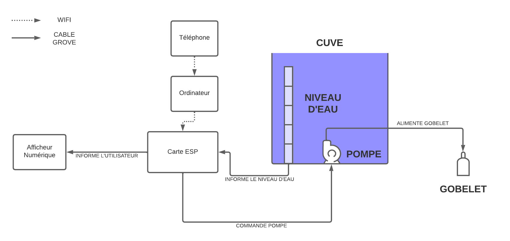

# Cpp_Projet
Github du Projet C++ (Liam CHRISMENT Johann COURAND)

## Présentation du projet. 

### Introduction. 

Notre projet consiste à concevoir un distributeur automatique d'eau qui permettra aux utilisateurs de s'hydrater facilement. Le système sera capable de recevoir des indications de l'utilisateur, telles que "Je suis assoiffé, cela fait depuis midi que je n'ai pas bu d'eau", et de délivrer une quantité d'eau adaptée à la demande de l'utilisateur.

Le système de distributeur automatique d'eau fonctionne de la manière suivante :

1/ L'utilisateur exprime son besoin en enregistrant sa voix via un téléphone portable.

2/ L'enregistrement vocal est envoyé à un ordinateur via une connexion Wi-Fi.

3/ Le système utilise l'API OpenAI GPT pour traiter l'enregistrement vocal et interpréter le besoin de l'utilisateur en traduisant la voix en quantité d'eau à fournir.

4/ L'ordinateur communique la quantité d'eau nécessaire à la carte électronique ESP via une connexion Wi-Fi.

5/ La carte électronique traite l'information et fournit une commande à une pompe pour fournir l'eau dans un gobelet.

- Hardware du système : 

Carte ESP Arduino 

Capteur de niveau Grove 

Afficheur OLED Grove 

Pompe à eau immergée Lextronic 

### Schéma de principe du système. 




## Description technique. 

### Diagramme de cas d'utilisation. 

### Diagramme de classe. 

### Description des classes. 

- ```SENSOR```

La classe Sensor est déclarée dans le fichier Sensor.hpp et a un attribut statique :

```static int sensorNbr``` : le nombre total de capteurs créés jusqu'à présent.

La classe Sensor est une classe abstraite, ce qui signifie qu'elle a deux méthodes virtuelles pures non implémentées :

```virtual void displayData()=0``` : affiche les données du capteur.

```virtual void retrieveData()=0``` : récupère les données du capteur.
La classe Sensor a un constructeur par défaut, ```Sensor()```, qui incrémente la variable statique sensorNbr chaque fois qu'un objet Sensor est créé.

- ```PUMP```

La classe Pump est déclarée dans le fichier Pump.hpp avec les attributs suivants :

```uint8_t pin```: le numéro de la broche à laquelle la pompe est connectée.

```double duration```: la durée d'exécution de la pompe.

```unsigned long previousMillis```: le temps précédent en millisecondes.

```unsigned long interval```: l'intervalle de temps en millisecondes.

```unsigned long currentMillis```: le temps actuel en millisecondes.

La classe a deux constructeurs, ```Pump()``` et ```Pump(uint8_t pin)```, ainsi qu'une méthode ```void sendSignal()```.

La méthode ```void sendSignal()``` envoie un signal à la pompe en utilisant la broche spécifiée, envoie des signaux HIGH et LOW pour l'activer et la désactiver, respectivement, et utilise le ```timer millis()``` pour contrôler le temps d'exécution de la pompe.

### Diagramme de séquence. 
